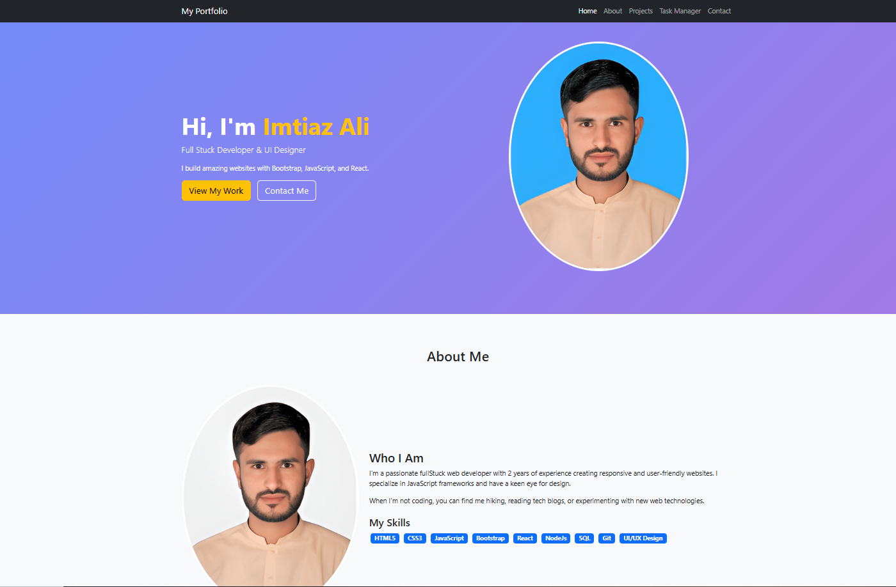
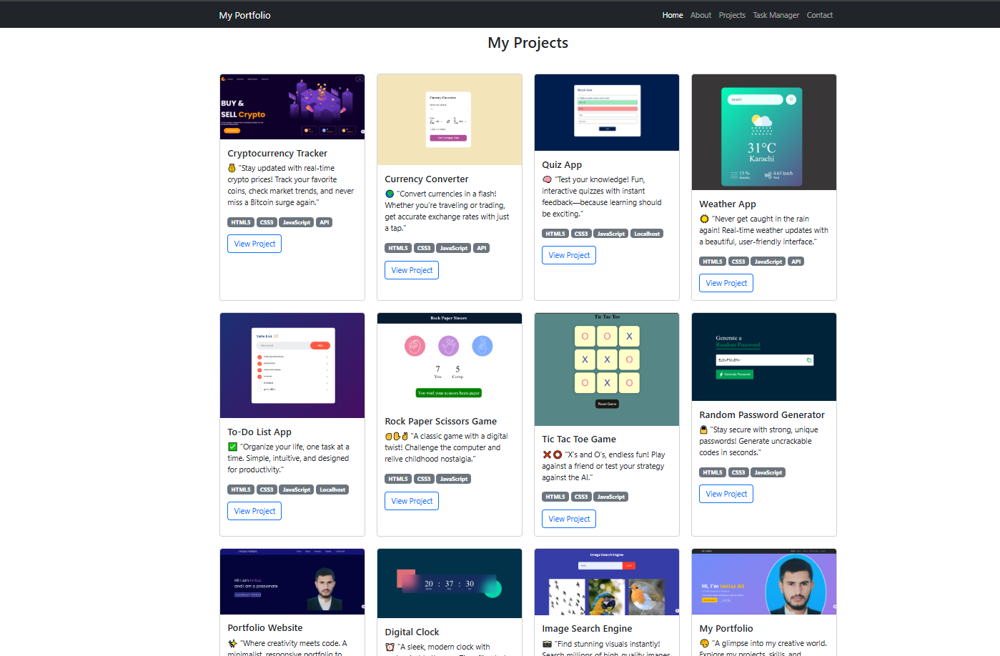
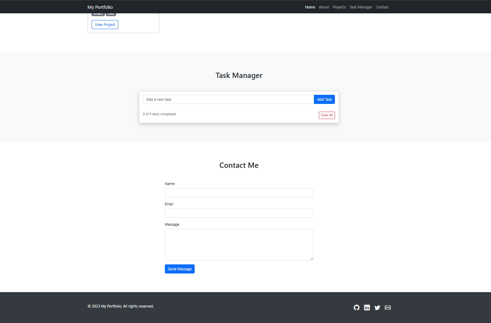

# My Portfolio Website 🌐

A fully responsive, feature-rich personal portfolio website built with **Bootstrap 5**, **JavaScript**, and custom CSS. It showcases developer projects, technical skills, an integrated task manager with localStorage persistence, and a validated contact form — all in a single-page application with smooth-scroll navigation.

---

## 📸 Interface Preview

### Hero Section & About Me
The landing page features a vibrant gradient hero banner with a professional profile image, a role tagline, and call-to-action buttons. The About Me section presents a biography alongside a skills badge grid covering HTML5, CSS3, JavaScript, Bootstrap, React, Node.js, SQL, Git, and UI/UX Design.



---

## 🌟 Key Features

### 🎨 Hero Section & Personal Branding
*   **Gradient Hero Banner**: A visually striking `linear-gradient(135deg, #6e8efb, #a777e3)` backdrop with a circular profile image bordered in white.
*   **Role Introduction**: Displays the developer's name, role title (*Full Stack Developer & UI Designer*), and a concise elevator pitch.
*   **Dual CTAs**: "View My Work" (scrolls to Projects) and "Contact Me" (scrolls to Contact) buttons with smooth CSS transitions.

### 📝 About Me & Skills Grid
*   **Biography Panel**: Two-column layout with a circular about-image and a structured biography.
*   **Skills Badge System**: Tech skills rendered as Bootstrap `badge` components covering 9 core technologies.

### 🗂️ Project Showcase Gallery
A responsive 4-column grid (`col-md-6 col-lg-3`) showcasing **17 real projects**, each rendered as a Bootstrap card with:
*   Project thumbnail image
*   Title and descriptive tagline
*   Tech stack badges (HTML5, CSS3, JavaScript, API, Bootstrap, LocalStorage)
*   "View Project" link button with hover lift animation (`translateY(-10px)`)




### ✅ Integrated Task Manager
A fully functional to-do list embedded directly into the portfolio as its own section, featuring:
*   **Add / Delete / Toggle Tasks**: Manage tasks through checkbox toggling, individual trash-button deletion, and a "Clear All" bulk action.
*   **Completion Tracking**: A live counter displays `X of Y tasks completed` with strikethrough styling on finished items.
*   **localStorage Persistence**: Task state is serialized as JSON and stored in `localStorage`, surviving page refreshes and browser restarts.
*   **Keyboard Support**: Pressing `Enter` in the input field triggers task creation instantly.

### 📬 Contact Form with Validation
A clean Bootstrap form with client-side field validation using regex patterns:
*   **Name**: Required, non-empty validation
*   **Email**: Required + RFC-compliant regex check (`/^[^\s@]+@[^\s@]+\.[^\s@]+$/`)
*   **Message**: Required, non-empty validation
*   Invalid fields receive Bootstrap's `is-invalid` class with feedback messages



### 🔗 Fixed Navigation Bar
A `fixed-top` dark Bootstrap navbar with smooth-scroll anchor links (`Home`, `About`, `Projects`, `Task Manager`, `Contact`) and a responsive hamburger toggle for mobile viewports.

### 🦶 Footer with Social Links
A dark-themed footer displaying copyright info and icon links to GitHub, LinkedIn, Twitter, and Email using Bootstrap Icons.

---

## 🛠️ Tech Stack

| Technology | Usage |
|---|---|
| **HTML5** | Semantic page structure, sections, and form elements |
| **CSS3** | Custom styling, gradient hero, card hover transitions, skill badges |
| **Bootstrap 5** | Responsive grid system, navbar, cards, forms, badges, and utility classes |
| **Bootstrap Icons** | Social media and UI iconography |
| **JavaScript (ES6)** | Smooth scrolling, task manager CRUD logic, form validation, localStorage API |

---

## 📁 Project Structure

```
My-Portfolio-Website/
├── assets/                     # Project thumbnails, profile images, and logo
│   ├── myImage.jpg             # Hero profile photo
│   ├── crptocurrency-tracker.png
│   ├── currency-convertor.png
│   ├── quiz-app.png
│   ├── weather-app.png
│   ├── ...                     # 20 total asset images
│   └── protfolio-logo-removebg-preview.png  # Favicon
├── screenshots/                # README preview images
│   ├── hero_about.png
│   ├── projects_grid.png
│   └── task_contact.png
├── index.html                  # Single-page application markup (734 lines)
├── style.css                   # Custom styles layered on top of Bootstrap
├── script.js                   # Smooth scroll, task manager, and form validation
└── README.md
```

---

## 🚀 How to Run

1.  Clone or download this repository.
2.  Open `index.html` in any modern web browser.
3.  No build tools or package managers required — it runs entirely client-side.

---

## 📄 License

© 2023 My Portfolio. All rights reserved.
